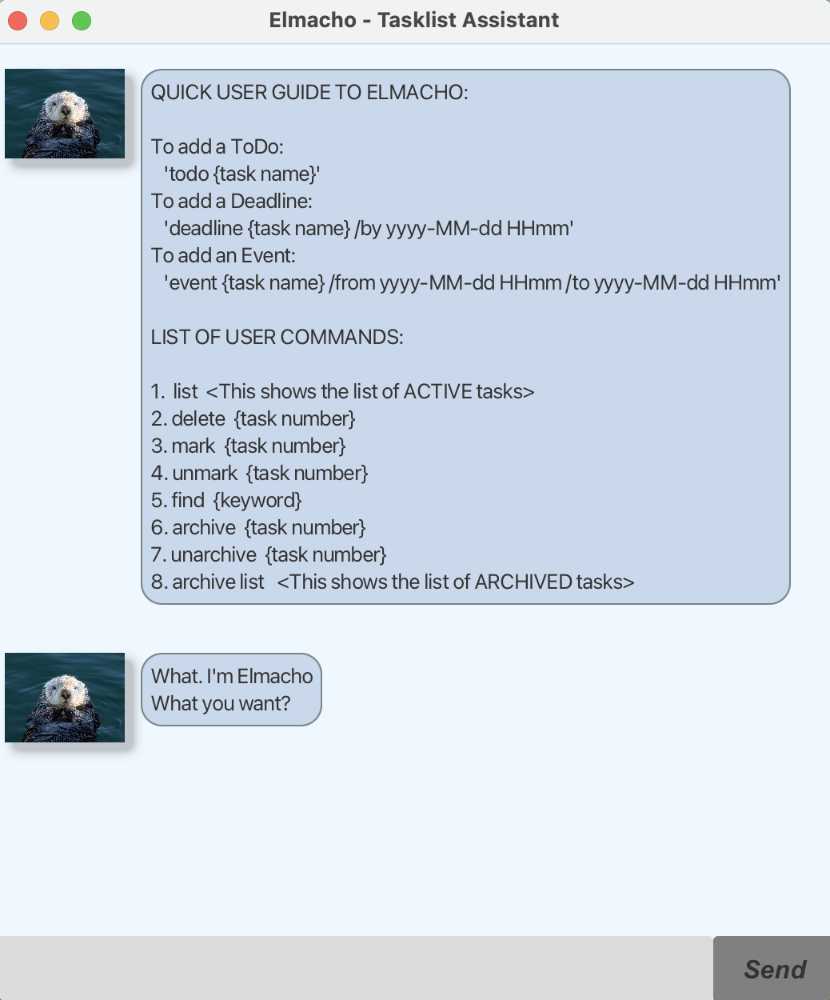

# Elmacho - Tasklist Assistant

This is _Elmacho_! A personal tasklist assistant that records all your tasks.

> "What. I'm Elmacho. What you want?" — Elmacho

## Here are the types of Tasks available:
:bulb: 
:memo:
:pencil:
- ToDo 
- Deadline 
- Event

## To create Tasks, run:
### ToDo :clipboard:   
Format: `todo {task description}`\
_eg. todo fold clothes_<br><br>
### Deadline :date:
Format: `deadline {task decription} /by {yyyy-MM-dd HHmm}`\
_eg. deadline tutorial 4 /by 2025-02-16 2359_<br><br>
### Event :spiral_calendar:
Format: `event {task description} /from {yyyy-MM-dd HHmm} /to {yyyy-MM-dd HHmm}`\
_eg. event club cohesion /from 2025-02-20 1500 /to 2025-02-20 2200_\

### If tasks are successfully stored, the output will be as follows:

```
Added Task: 
  [T][ ] fold clothes 
Now you have 1 tasks in the list.
```


```
Added Task:
  [D][ ] tutorial 4 (By: Feb 16 2025 11:59pm)
Now you have 2 tasks in the list.
```


```
Added Task:
  [E][ ] club cohesion (From: Feb 20 2025 3:00pm To: Feb 20 2025 10:00pm)
Now you have 3 tasks in the list.
```

## Features:
### Deleting a task :`delete` 
Format: `delete {task number}`
_eg. delete 1_
```
Deleted Task: 
  [T][ ] fold clothes 
Now you have 2 tasks in the list.
```
<br>

### Marking a task complete: `mark`
Format: `mark {task number}`
_eg. mark 1_
```
Finally. Marked this task as done: 
  [X] fold clothes 
```
<br>

### Unmarking a task: `unmark` 
Format: `unmark {task number}`
_eg. unmark 1_
```
Another task not done...: 
  [ ] tutorial 4
```
<br>

### Archiving a task: `archive`
Format: `archive {task number}`
_eg. archive 2_
```
Archived task: 
  [T][ ] tutorial 4
Now you have 1 tasks in the archived list,
2 tasks in the list.
```
<br>

### Unarchiving a task: `unarchive`
Format: `unarchive {task number}`
_eg.  unarchive 1_
```
Unarchived task: 
  [T][ ] tutorial 4
Now you have 3 tasks in the list.
```
<br>

### Finding tasks through keywords: `find`
`find {keyword}`
_eg. find tutorial_
```
2.[D][ ] tutorial 4 (By: Feb 16 2025 11:59pm)
```
<br>

### Displaying full tasklist: `list/archive list`
Format: `list / archive list`
_eg. list / archive list_
```
1.[T][X] fold clothes 
2.[D][ ] tutorial 4 (By: Feb 16 2025 11:59pm)
3.[E][ ] club cohesion (From: Feb 20 2025 3:00pm To: Feb 20 2025 10:00pm)
```
<br>

### Viewing help: `help`
Format: `help`  
_List of features and formats will appear_
<br>

### Exiting the program: `bye`
Format: `bye`  
_Elmacho exits_
> [!CAUTION]
> Only delete when you're sure you've finished the task!   
> Archive if you may still go back to it.

## Starting Elmacho
1. Ensure the right java version is installed
> `java -version`
2. Download the `.jar` file
- Alternatively, clone the Github Repository.
> `git clone https://github.com/chenxy12345/ip`
3. Navigate to the Directory the file is in
> `cd /path/to/your/jar/file`
4. Run the `.jar` file
> java -jar elmacho.jar
> 
A GUI similar to below should appear in a few seconds.

5. Type the command in the command box and press `Send` to execute it.

**To view the github repository: click [here](https://github.com/chenxy12345/ip)**